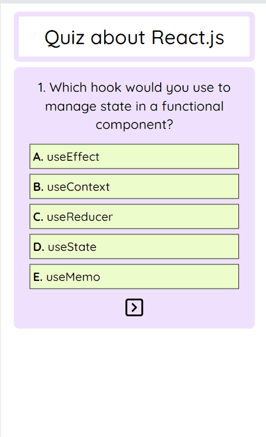

# Quiz about React.js ⚛️

This project is a React quiz application designed to test your knowledge of React.js. It represents my second attempt at creating a quiz application, with the aim of improving and optimizing the previous version. 

## Features 💡

- **Quiz Navigation**: Users can navigate through a series of questions and select answers.

- **State Management**: Utilizes React's state management to handle user interactions and maintain quiz state.

- **Responsive Design**: The application is responsive, ensuring a smooth user experience across different devices and screen sizes.

- **Modal Feedback**: A modal provides feedback on the number of correct answers upon quiz completion.

- **Saved User Choices**: Selected answers are retained, allowing users to review their choices even after navigating through different questions.

## Technologies ⚙️

## Overview 📱

